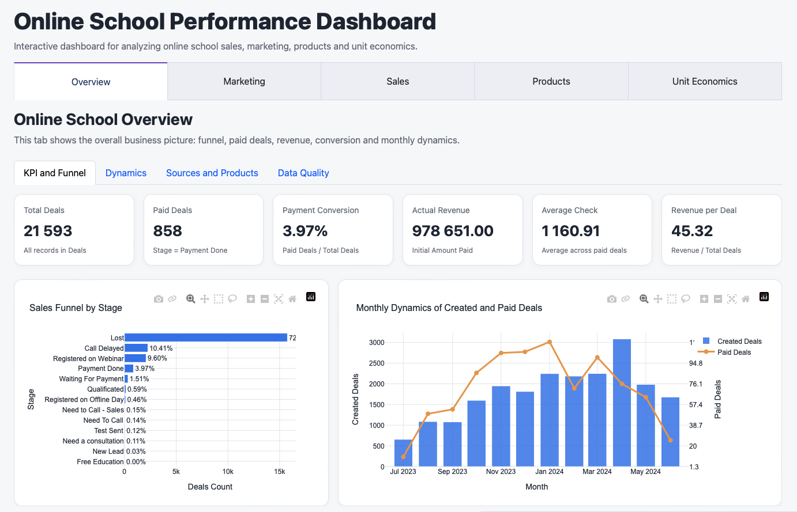
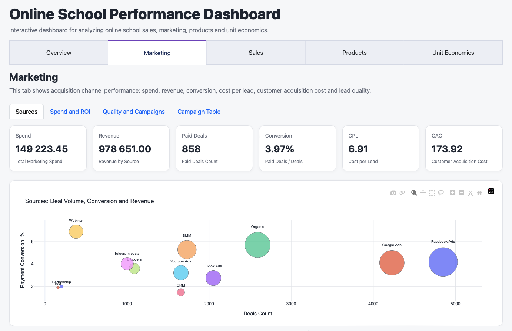
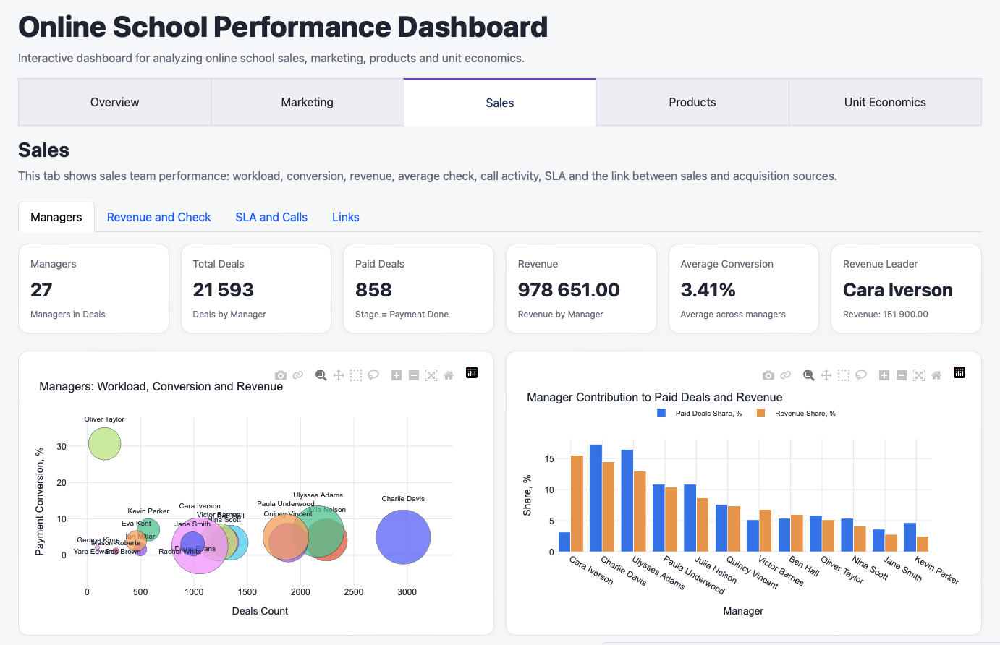
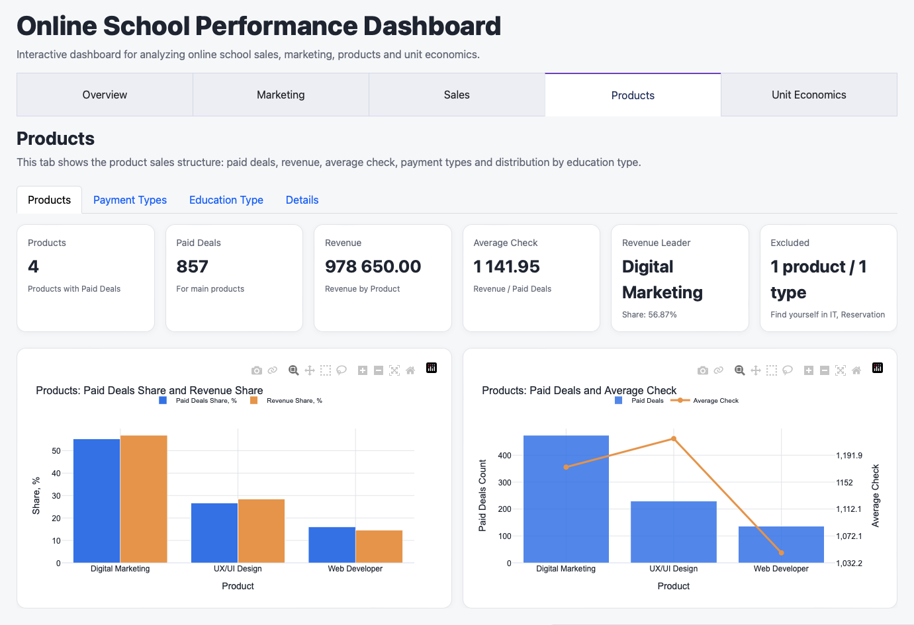
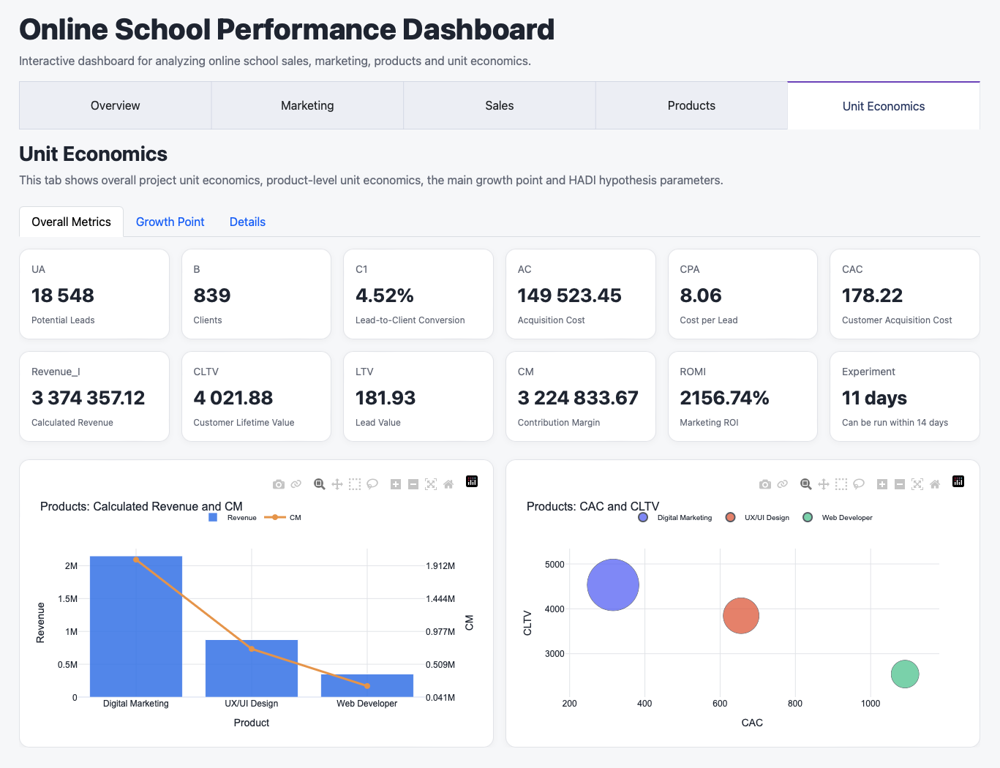
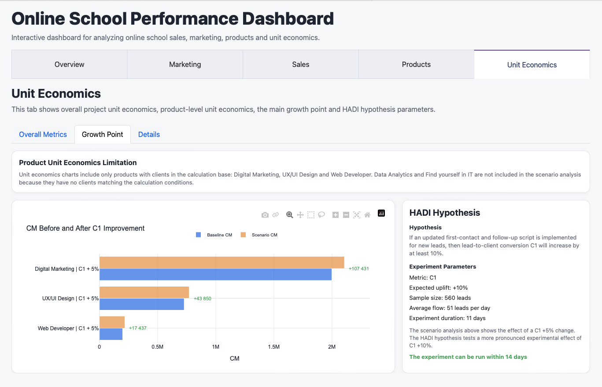

# Online School Performance Analytics

End-to-end business analytics project for an online school: data preparation, data audit, cleaning rules, exploratory data analysis, marketing and sales performance analysis, product analytics, unit economics, growth hypothesis and an interactive Plotly Dash dashboard.

## Project Overview

This project analyzes the performance of an online school using CRM, sales activity, calls and marketing spend data.

The goal is to identify key factors affecting business performance and find manageable growth opportunities across the sales funnel, acquisition sources, sales team performance, products, payment types and unit economics.

The project is structured as a reproducible analytics workflow: from raw data audit and cleaning rules to business analysis, unit economics and dashboard-ready datasets.

## Business Questions

The analysis focuses on the following questions:

- How many deals are created and how many convert to payment?
- Which marketing sources and campaigns generate deals, paid deals and revenue?
- How effective is the sales team across deal volume, conversion and revenue?
- Which products and payment types drive the main financial result?
- What data quality limitations affect geography and language-level analysis?
- What does unit economics show at the project and product level?
- Which metric can be used as a manageable growth point?
- What hypothesis can be tested within 14 days?

## Repository Structure

```text
online-school-performance-analytics/
├── README.md
├── requirements.txt
├── dashboard/
│   └── app.py
├── data/
│   ├── raw/
│   │   ├── calls_raw.xlsx
│   │   ├── contacts_raw.xlsx
│   │   ├── deals_raw.xlsx
│   │   └── spend_raw.xlsx
│   └── processed/
│       ├── calls_clean.csv
│       ├── contacts_clean.csv
│       ├── deals_clean.csv
│       ├── spend_clean.csv
│       └── unit economics and dashboard-ready output tables
├── docs/
│   ├── data_dictionary.xlsx
│   ├── data_dictionary.pdf
│   ├── cleaning_rules.docx
│   └── cleaning_rules.pdf
├── images/
│   └── dashboard screenshots
├── notebooks/
│   ├── 01_data_audit.ipynb
│   ├── 02_data_cleaning.ipynb
│   ├── 03_eda_business_analysis.ipynb
│   ├── 04_unit_economics.ipynb
│   └── project_util.py
└── reports/
```

## Tools and Technologies

- Python
- pandas
- numpy
- matplotlib
- plotly
- Dash
- dash-bootstrap-components
- openpyxl
- Jupyter Notebook
- PyCharm
- GitHub

## Data

The repository includes anonymized raw datasets and processed datasets used for the analysis.

The raw data does not contain customer names, emails or phone numbers. CRM-style IDs are preserved because they are required for relationship checks between tables. Synthetic manager names are used as analytical categories.

Main raw files:

- `calls_raw.xlsx`
- `contacts_raw.xlsx`
- `deals_raw.xlsx`
- `spend_raw.xlsx`

Main processed files:

- `calls_clean.csv`
- `contacts_clean.csv`
- `deals_clean.csv`
- `spend_clean.csv`

Additional processed CSV files are generated by the unit economics notebook and used by the dashboard.

## Documentation

The `docs/` folder contains supporting documentation:

- `data_dictionary.xlsx` — editable data dictionary with field descriptions, data types, valid values, cleaning rules and analysis usage notes.
- `data_dictionary.pdf` — PDF version of the data dictionary for quick review.
- `cleaning_rules.docx` — editable data cleaning rules document.
- `cleaning_rules.pdf` — PDF version of the cleaning rules.

## Project Workflow

The project follows an end-to-end analytics workflow:

1. Data dictionary and business rules preparation
2. Data audit and data quality assessment
3. Cleaning rules definition
4. Data cleaning and preparation
5. Descriptive statistics and EDA
6. Sales funnel and time series analysis
7. Marketing source and campaign analysis
8. Sales team performance analysis
9. Product, payment and education type analysis
10. Geography and language data quality review
11. Financial analysis
12. Unit economics calculation
13. Growth point selection and HADI hypothesis
14. Interactive dashboard development

## Notebooks

| Notebook | Purpose |
|---|---|
| `01_data_audit.ipynb` | Initial data audit, structure review, missing values, duplicates, table relationship checks and preliminary cleaning strategy. |
| `02_data_cleaning.ipynb` | Data cleaning based on documented rules, generation of cleaned datasets for further analysis. |
| `03_eda_business_analysis.ipynb` | Exploratory and business analysis: funnel, marketing, sales, products, payments, geography and revenue. |
| `04_unit_economics.ipynb` | Unit economics calculation, product-level metrics, growth point selection and HADI hypothesis. |

## Key Business Rules

Several business rules were defined before analysis:

- The main analysis table is `deals_clean.csv`.
- A paid deal is defined as `Stage = Payment Done`.
- Actual revenue is calculated using `Initial Amount Paid` only for paid deals.
- `Offer Total Amount` is treated as potential contract value, not actual revenue.
- Deals with `Stage = Payment Done` and missing payment amount are included in payment conversion, but excluded from revenue and average check calculations.
- `Source` is used as the main level for marketing analysis.
- `Campaign`, `Term`, `Content`, `AdGroup` and `Ad` are used as additional marketing details, not as the only matching keys.
- Product, payment type and education type analysis is mainly based on paid deals.
- Rows with data quality flags are not removed automatically; they are excluded only from the calculations where the issue is critical.

## Key Metrics

| Metric | Value |
|---|---:|
| Total deals | 21,593 |
| Paid deals | 858 |
| Payment conversion | 3.97% |
| Actual revenue | 978,651.00 |
| Average check | 1,160.91 |
| Revenue per deal | 45.32 |
| Marketing spend | 149,223.45 |
| CPL | 6.91 |
| CAC | 173.92 |
| Unit economics lead base (UA) | 18,548 |
| Unit economics clients (B) | 839 |
| Lead-to-client conversion (C1) | 4.52% |
| Calculated revenue (Revenue_I) | 3,374,357.12 |
| Contribution margin (CM) | 3,224,833.67 |
| ROMI | 2,156.74% |
| HADI experiment duration | 11 days |

## Key Findings

- The online school has a large deal flow: 21,593 deals were created, but only 858 deals reached payment.
- Overall payment conversion is low at 3.97%, so improving the lead-to-payment funnel is the main business opportunity.
- The main revenue-generating acquisition sources are Facebook Ads, Organic, Google Ads and SMM.
- Marketing unit economics is positive at the aggregate level: total marketing spend is 149,223.45, while actual revenue from paid deals is 978,651.00.
- Digital Marketing is the strongest product by paid deals and revenue. It accounts for the largest share of the product-level business result.
- Payment type analysis is limited by a high share of unknown values, so payment-type conclusions should be interpreted carefully.
- Geography and German language-level analysis is limited by missing data: around 90% of city values and around 98% of language-level values are missing.
- Product-level unit economics is positive for the products with clients in the calculation base: Digital Marketing, UX/UI Design and Web Developer.
- C1, the lead-to-client conversion metric, was selected as the main manageable growth point.
- The proposed HADI hypothesis tests whether an updated first-contact and follow-up script can increase C1 by at least 10%. Based on the average lead flow, the experiment can be run within 11 days, which fits the 14-day validation window.

## Dashboard

An interactive dashboard was built with Plotly Dash. It includes five main sections:

- Overview
- Marketing
- Sales
- Products
- Unit Economics

The dashboard uses cleaned and dashboard-ready CSV files from `data/processed/`.

### Dashboard Preview

#### Overview



#### Marketing



#### Sales



#### Products



#### Unit Economics



#### Growth Point and HADI Hypothesis



## How to Run the Project

Install dependencies:

```bash
pip install -r requirements.txt
```

Run the dashboard locally:

```bash
python dashboard/app.py
```

Then open the local Dash URL in a browser, usually:

```text
http://127.0.0.1:8050/
```

To reproduce the data pipeline, run notebooks in this order:

```text
01_data_audit.ipynb
02_data_cleaning.ipynb
03_eda_business_analysis.ipynb
04_unit_economics.ipynb
```

## Project Status

The English portfolio version includes:

- anonymized raw data;
- processed datasets;
- data dictionary;
- cleaning rules;
- four validated notebooks;
- helper Python functions;
- interactive English dashboard;
- dashboard screenshots.

Potential next improvements:

- prepare a concise English analytical report;
- add a Notion portfolio case page;
- prepare a short LinkedIn project summary.
